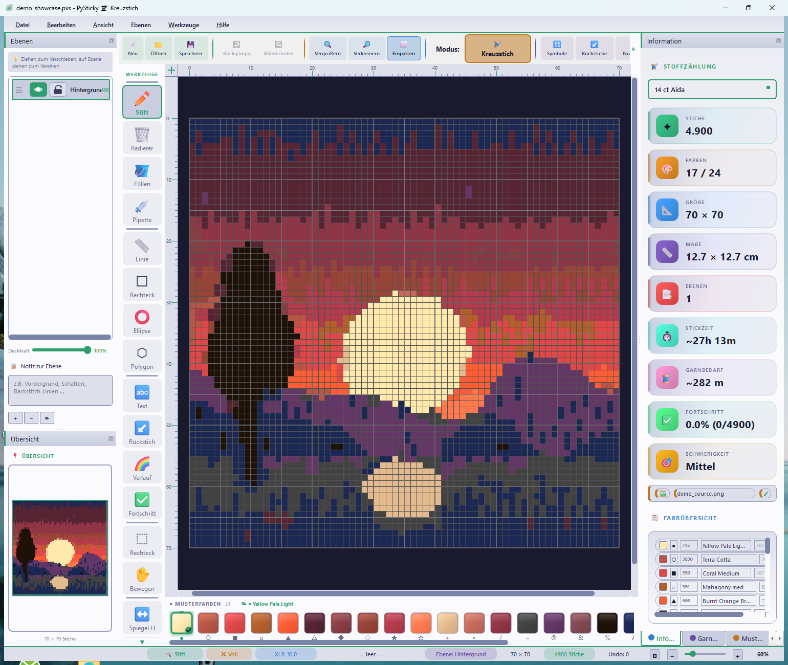
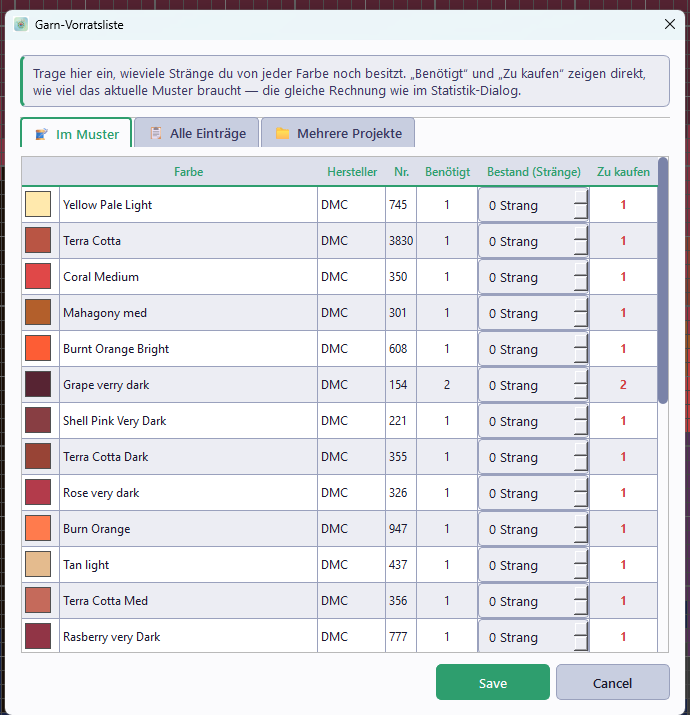
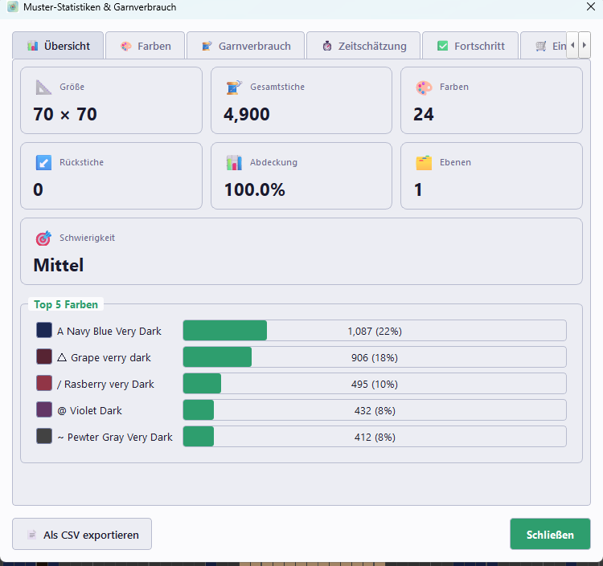

# PySticky — Cross-Stitch Software

*[Deutsch](README.md) | English*

Modern pattern editor for cross-stitch, in Python + PySide6.


## Screenshots

|                                       Editor                                        |                                    Yarn Inventory List                                     |                                   Pattern Statistics                                    |
| :-----------------------------------------------------------------------------------: | :----------------------------------------------------------------------------------------: | :-----------------------------------------------------------------------------------------: |
|  |  |  |

*(Sample pattern generated, not a real photo — shows color quantization during image import.)*

## Features

### Pattern Editor
- Grid-based editor with zoom (20–300%) and pan
- 15 tools: pencil, eraser, fill, eyedropper, line, rectangle (filled + outline), ellipse (filled + outline), polygon (filled + outline), text, backstitch, gradient, progress marker, selection (rectangle + lasso), move (pan)
- Stitch types: full cross stitch, half stitches (two diagonal directions), quarter stitches (all four corners), three-quarter stitch, French knot, backstitch, **beads**, **diamond painting drills** — bead and diamond are set automatically when drawing with a bead/DP color
- Selection tools: rectangle + lasso with shared clipboard
- Selection operations: copy / cut / paste / delete / fill / rotate 90° / mirror (via menu or keyboard shortcut)
- Mirror mode while drawing (X / Y / both axes, 2-/4-/8-fold symmetry)
- Magnetic grid (snap-to-grid)
- Progress marking of completed stitches
- Drag & drop of `.pxs` files and images directly onto the window

### Layer System
- Multiple layers with visibility, lock, opacity
- Reorder layers, merge them, or draw only the active one
- Dim other layers for focused work

### Color and Yarn Management
- 14 yarn palettes (DMC, Anchor, Madeira, Cosmo, Olympus, Weeks Dye Works, Valdani, Venus, Finca, Sullivans, Riolis Gamma, Classic Colorworks, Gentle Art Sampler Threads) + **Mill Hill Beads** (beads, 100+ codes) + **3 diamond painting palettes** (DMC Diamond Painting 450 codes, Diamond Art Club + Diamond Dotz as extensible skeletons)
- **Tweed blends** (multi-strand blending): combine two yarns in one needle (e.g. 1 strand DMC 310 + 1 strand DMC 745 for a salt & pepper effect). The blended color is computed perceptually in CIE-Lab, both yarn numbers appear in the legend.
- Color bar with drag & drop:
  - Dragging from the palette onto the color bar adds a color
  - Dragging one swatch onto another swaps the two colors (quick color swap)
- Convert palette (e.g. DMC → Anchor), color palette manager (sort, merge, remove unused)
- Replace color (A → B) and swap colors (A ⇄ B) via a dialog with color-preview icons in the combo boxes
- Merge similar colors, generate color harmonies
- Color-blindness simulation (protanopia / deuteranopia / tritanopia)
- Symbol editor per color with search function (substring on character, Unicode name, code point `U+25CF` or `25cf`)
- Symbols extensible via `resources/symbols.txt`

### File + Export
- Custom `.pxs` format (JSON-based) with autosave + recovery on startup
- Recent-files menu (`File → Recently opened`)
- Pattern properties: author, copyright, stitching date, free-form notes — automatically appear on the HTML/PDF export cover page
- Import: images (PNG/JPG/BMP/GIF/WebP/TIFF) with color quantization, dithering and **confetti reduction**, XSD/PAT/**OXS** formats, pattern library
- Export: HTML (multi-page, print-ready), PDF (A4/A3/A2/Letter via reportlab), PNG/JPG/BMP, direct print, **OXS (Open Cross Stitch XML)**
- **Manufacturer cross-reference in the HTML/PDF legend**: additional columns with the closest yarn equivalents in other manufacturers' palettes (Anchor, Madeira, …), matched via CIE-Lab Delta-E
- Export cache (`io/export_cache.py`): one-time pre-computation of composite grid data per export run, replacing the per-pixel layer iteration in cover/preview/pattern pages

#### OXS Format (Open Cross Stitch XML)
Open exchange standard, readable by Pattern Maker, MacStitch/WinStitch (Ursa Software), Stitch Fiddle and other commercial tools. PySticky can **read and write** OXS — all stitch types (full, half, quarter, three-quarter stitch, backstitch, French knot, bead) survive the roundtrip. Manufacturer and catalog number from OXS are matched against the loaded palettes and resolved back to real threads.

Implementation: [io/formats/oxs_io.py](src/pysticky/io/formats/oxs_io.py).

#### Confetti Reduction during Image Import
"Confetti" are isolated single pixels or mini clusters in the quantized pattern that create a disproportionate number of thread changes when stitching and are barely visible. The "Reduce confetti" slider (1-10, default 1 = off) filters them out by assigning small connected clusters to the dominant neighboring color. Practical recommendation: 2 for subtle, 3-5 for aggressive reduction on photo-realistic patterns.

Algorithm: connected-component labeling (4-neighborhood) + iterative reassignment of small clusters to the most common neighboring color in an 8-neighborhood.

Implementation: [core/confetti_reduction.py](src/pysticky/core/confetti_reduction.py).

#### Cross-Reference Columns in the Legend
In the Settings dialog (tab "Files" → section "Export") any manufacturer palettes can be activated as a cross-reference. The HTML and PDF legend then gain additional columns with the respective closest yarn equivalent. Matched via CIE-Lab Delta-E (perceptually based, not plain RGB). Results are cached.

Implementation: [core/thread_cross_ref.py](src/pysticky/core/thread_cross_ref.py).

#### Beads (v0.6)
Dedicated Mill Hill bead palette with 100+ codes (Glass Seed Beads, Petite Crystal, Antique etc.). Colors from bead palettes are automatically recognized (`ColorEntry.is_bead`) — when drawing, the stitch type is set to BEAD without needing a separate tool. In the HTML/PDF legend, beads appear in their own section ("Beads"), and bead colors are NOT counted toward yarn-strand requirements.

Implementation: palette in [resources/palettes/Mill_Hill_Beads_Farben.json](src/pysticky/resources/palettes/Mill_Hill_Beads_Farben.json), data model in [core/pattern.py](src/pysticky/core/pattern.py) (`ColorEntry.is_bead`), automatic stitch-type mapping in `Pattern.set_stitch`.

#### Diamond Painting (v0.8)
PySticky can now also generate **diamond painting templates** — a full-fledged mode, not just a render overlay.

- **Pattern mode** (`Pattern.mode ∈ {"stitch", "diamond"}`): every pattern carries its own mode, persisted in `.pxs`. When opening, the entire UI adapts automatically — mode-switch button, info-panel labels, fabric/drill selection, available tools. Older `.pxs` files without a mode field are loaded in stitch mode (backward compatible).
- **Mode switch in the toolbar** (`Mode: 💎 Diamond` / `🧵 Cross-stitch`): a prominent toggle button. The text always shows *which mode* you're switching to. Plus the menu `View → Diamond Painting View` and shortcut `Ctrl+D` — all three paths stay in sync.
- **Auto-palette on switch**: switching to Diamond loads the `DMC Diamond Painting` palette and remembers the previously active yarn palette. Switching back returns the palette panel to the remembered palette.
- **UI adapts mode-specifically**: in DP mode the info panel shows "Drills" instead of "Stitches", "Adhesive time" instead of "Stitching time" (~3s/drill instead of ~20s/stitch), "Drill requirement" with a 10% reserve instead of yarn meterage, and drill-grid selection (2.5/2.8/3.0 mm) instead of Aida count. Stitch-specific tools (backstitch, French knot, half/quarter/three-quarter stitch) are grayed out in DP mode.
- **Three diamond painting palettes**: `DMC_Diamond_Painting_Farben.json` (450 official codes), plus skeletons for `Diamond_Art_Club_Diamond_Painting_Farben.json` and `Diamond_Dotz_Diamond_Painting_Farben.json` (~40 sample codes each, since manufacturers don't publish RGB lists — see [resources/palettes/DIAMOND_PALETTES.md](src/pysticky/resources/palettes/DIAMOND_PALETTES.md) for extending them). Paint With Diamonds / Dreamer Designs use DMC codes → these use the DMC DP palette directly.
- **Automatic stitch-type detection**: palettes with `Diamond` in the filename are flagged via `ThreadPalette.is_diamond=True`. Colors from DP palettes automatically set the `DIAMOND` stitch type when drawing, analogous to beads.
- **Drill rendering**: faceted drills with a highlight on top and shadow at the bottom — the typical DP look. Symbols are replaced with **DMC numbers**, the Aida fabric texture with a DP adhesive backing.

Implementation: `Pattern.mode` in [core/pattern.py](src/pysticky/core/pattern.py), `StitchType.DIAMOND = 11` in [core/stitch.py](src/pysticky/core/stitch.py), `ThreadPalette.is_diamond` in [core/palette.py](src/pysticky/core/palette.py), mode-switch button in [ui/builders/mw_toolbar_mixin.py](src/pysticky/ui/builders/mw_toolbar_mixin.py), central mode sync in [ui/handlers/view_handlers.py](src/pysticky/ui/handlers/view_handlers.py) (`_apply_pattern_mode`), info-panel labels in [ui/panels/info_panel.py](src/pysticky/ui/panels/info_panel.py) (`set_mode`), drill renderer in [ui/canvas/mixins/rendering_mixin.py](src/pysticky/ui/canvas/mixins/rendering_mixin.py). Tests in [tests/test_diamond.py](tests/test_diamond.py) (25 tests).

#### Tweed Blending / Multi-Strand Yarn (v0.6)
Professional cross-stitch often combines two yarns in one needle — e.g. 1 strand DMC 310 + 1 strand DMC 745 for a salt & pepper effect. The menu item `Edit → Palette → Create Tweed Blend…` opens a dialog with a preview that combines two threads from the loaded palettes (1–6 strands per component adjustable). The blended color is computed perceptually in CIE-Lab space (no plain RGB average). Both yarn numbers appear in the legend (e.g. "DMC 310 + DMC 745 (1+1)"). Blends survive the .pxs roundtrip; in the OXS export the components are included as custom attributes.

Implementation: [core/thread.py](src/pysticky/core/thread.py) (`Thread.blend`, `_blend_colors_lab`, `_rgb_to_lab_single`/`_lab_to_rgb_single`), dialog in [ui/dialogs/blend_threads_dialog.py](src/pysticky/ui/dialogs/blend_threads_dialog.py).

#### Working Chart Pages with Overlap (v0.6)
Configurable in Settings → Files → Export → "Page overlap" (0-20 stitches). Each HTML/PDF page additionally shows the first N stitches of the neighboring page (right/bottom), visually marked as an overlap zone. Makes it easier to line up printed pages. Plus a mini page index (small grid overview of all pages with the current page highlighted) and arrow markers to the neighboring pages.

Implementation: [io/html_export_pages.py](src/pysticky/io/html_export_pages.py) (`_build_page_mini_index`, `_build_page_neighbor_markers`), per-page overlap calculation with `core_end_x + overlap`.

#### Internationalization (v0.7)
PySticky now supports **multilingual interfaces**. Included: German (default) and English (~150 translated strings for menus, toolbar, status bar, common dialogs). Language can be switched in `Settings → General → Language` (Auto / German / English).

Architecture: JSON-dictionary-based with identity fallback (default language = source strings in the code = German). Missing translations return the original German string, no crash. Additional languages can simply be added by creating a new `<langcode>.json` in `resources/i18n/` — the loader finds them automatically.

Implementation: [core/i18n.py](src/pysticky/core/i18n.py) (`TranslationManager`, `t()`, `set_language()`), dictionaries in [resources/i18n/](src/pysticky/resources/i18n/).

Note: migration of the UI strings is iterative. Core menus and critical dialogs are translated; deeper dialogs still run in German. Anyone wanting another language copies `en.json` → `<code>.json` and translates the values.

#### Plugin API (v0.7)
**Custom Python scripts can manipulate the pattern**. Plugins live in their own directories with a `manifest.json` + Python module and are automatically discovered from:

1. `src/pysticky/plugins/builtin/` (bundled)
2. `~/.pysticky/plugins/` (user-installed)

Plugin signature:
```python
def run(pattern, ctx):
    width = ctx.prompt_int("How wide?", default=10, minimum=1, maximum=100)
    if width is None:  # user cancelled
        return
    # ... manipulate pattern via pattern.set_stitch(), pattern.add_color() etc. ...
    ctx.show_message(f"Done — {width} stitches set.")
```

Bundled example plugins (see [src/pysticky/plugins/builtin/](src/pysticky/plugins/builtin/)):
- **Generate border** — draws a rectangular border with configurable spacing + line thickness
- **Fill checkerboard** — two-color checkerboard with configurable cell size
- **Mirror horizontal** — copies the left half of the pattern mirrored onto the right half (for symmetric motifs)

Invocation: `Tools → Plugins…`. Implementation: [plugins/api.py](src/pysticky/plugins/api.py) (discovery, manifest, run_plugin), dialog in [ui/dialogs/plugin_dialog.py](src/pysticky/ui/dialogs/plugin_dialog.py).

#### PDF Protection (v0.7)
A new protection dialog appears during PDF export with three options:

- **Password** — encrypts the PDF with AES-128 (reportlab StandardEncryption). Without the password, the PDF cannot be opened.
- **Watermark** — text is drawn large and diagonally with 35% transparency on every page ("DRAFT", "PREVIEW", designer name, …).
- **Allow printing / Allow copying** — checkboxes that are written into the PDF permissions (respected by Adobe Reader and most viewers).

Implementation: [io/pdf_export.py](src/pysticky/io/pdf_export.py) (`StandardEncryption` integration, `_draw_footer` hook for the watermark), dialog [ui/dialogs/pdf_protect_dialog.py](src/pysticky/ui/dialogs/pdf_protect_dialog.py).

#### Tablet and Pen Pressure (v0.8)
PySticky now responds to pen pressure (Wacom, Surface Pen, iPad with Apple Pencil). When a pen is active, pressure modulates the brush size of the pencil tool — light pressure = 1 stitch, full pressure = up to N stitches in a circle (configurable). Mouse input remains unchanged: 1 click = 1 stitch.

Configurable in `Settings → Tools → Tablet & Pen`: "Use pressure" and "Max. brush size" (1–20).

Implementation: `tabletEvent` handler in [ui/canvas/mixins/events_mixin.py](src/pysticky/ui/canvas/mixins/events_mixin.py) stores `_tablet_pressure`, the pencil tool ([ui/tools/pencil_tool.py](src/pysticky/ui/tools/pencil_tool.py)) computes the brush radius from it.

#### Touch Gestures / Pinch-Zoom (v0.8)
For touchscreens (Surface, iPad) there is pinch-zoom on the canvas. Off by default because Windows shows a "tablet" toast on some devices during a long drag when touch events are accepted. Can be enabled in `Settings → Tools → Tablet & Pen → Touch gestures`.

Implementation: `grabGesture(PinchGesture)` + an `event()` override on the canvas, `_handle_gesture` with threshold detection for the zoom trigger.

#### Screen EyeDropper (v0.8)
`Tools → Pick color from screen…` opens a full-screen overlay with the current screenshot. Clicking a spot picks the pixel color; PySticky automatically looks up the closest yarn equivalent in the loaded palettes (CIE-Lab Delta-E, bead palettes excluded) and adds it to the pattern palette.

Useful for: picking up colors from reference images in a browser, photo editor, or other tool.

Implementation: [ui/dialogs/screen_eyedropper_dialog.py](src/pysticky/ui/dialogs/screen_eyedropper_dialog.py) with testable top-level functions `pick_color_at` and `find_nearest_thread`.

#### Snapshot Diff (v0.8)
In the Versions dialog (`File → Versions…`) there is now a "⇄ Compare with current" button. It opens a three-column comparison: Old | New | Diff overlay with stitch changes color-coded (green = added, red = removed, yellow = changed). Statistics at the top: X+ Y- Z~.

Implementation: [core/pattern_diff.py](src/pysticky/core/pattern_diff.py) (`compute_diff`, `DiffStats`, `DiffResult` — UI-free, headlessly testable), dialog [ui/dialogs/pattern_diff_dialog.py](src/pysticky/ui/dialogs/pattern_diff_dialog.py).

#### Smart Resize (v0.8)
The resize dialog has a checkbox "Redistribute stitches (smart resize)". When active: the pattern is bilinearly scaled like a pixel image, stitches redistributed to the new cell size — ideal when scaling up (50×50 → 100×100 with the stitches fully utilized instead of 75% empty cells). Off: classic cropping/padding as before.

The stitch-type grid is carried over with nearest-neighbor, backstitches are scaled proportionally.

Implementation: [core/smart_resize.py](src/pysticky/core/smart_resize.py).

### Visualization
- **Fabric preview panel**: realistic depiction of the finished piece on the chosen fabric (Aida 11–32, Evenweave, linen) and fabric color
  - Full cross stitches drawn as an X shape
  - Half / quarter / three-quarter stitches as real diagonal yarn lines
  - French knots as small shiny spheres
  - Backstitches, fabric texture, zoom
- **Heatmap dialog** (`Edit → Heatmap…`): visualize the pattern as a heatmap, axes stitch density or color variety, configurable block size
- **Pattern preview** as a separate dialog
- **Tile preview** for repeating patterns
- **Minimap** with viewport indicator

### Workflow Tools
- Statistics dialog: stitch count per color, yarn consumption (Aida 11–32), time estimate, kit cost calculator
- Stitch-path optimization: computes an efficient order of stitches per color
- Pattern library with thumbnails
- Project templates (bookmark, doily, cushion, Christmas, …)
- Properties dialog: pattern metadata (author, copyright, stitching date, notes) — notes also appear on the export cover page

### Performance
- Chunk-based canvas caching for large patterns
- Level of detail (LOD): skip symbols/grid at low zoom
- Auto-activation of performance optimizations above a threshold
- Export cache for HTML/PDF: precomputed numpy arrays instead of per-cell layer walks
- Details: see [`PERFORMANCE_OPTIMIZATIONS.md`](PERFORMANCE_OPTIMIZATIONS.md) and [`src/pysticky/ui/canvas/README.md`](src/pysticky/ui/canvas/README.md)

### UI
- **Welcome screen** at startup with quick-start actions (New / Open / From image) and a list of recently opened files
- **Dark + Light theme**, switchable live in settings
- **Color-grouped toolbar**: File (green), Edit (orange), Zoom (blue), View (purple), Symmetry (red), Stitch (yellow) — visually separable sections with colored dividers
- **Status bar with color pills**: tool, stitch type, position, color-under-mouse, layer, size, stitch count, undo — each with its own accent color and a fixed minimum width (no flickering on mouse movement)
- Dockable panels: Palette, Color bar, Layers, Info, Minimap, Tile preview, Fabric preview, Progress
- Rulers + clickable navigation, zoom slider in the status bar
- Configurable settings (6 tabs: General / Canvas / Tools / Colors / Files / Keyboard shortcuts)

## Installation

### Prebuilt .exe (Windows)

A prebuilt Windows `.exe` is available on the
[Releases page](https://github.com/HasoSchno70/Pysticky/releases) —
download and run directly, no Python installation required.

### From source

```bash
git clone https://github.com/HasoSchno70/Pysticky.git
cd Pysticky

python -m venv .venv
# Windows
.venv\Scripts\activate
# Linux/Mac
source .venv/bin/activate

pip install -r requirements.txt
python run.py
```

Optional for developers/building:
```bash
pip install -e ".[dev]"     # pytest, pytest-qt, black, ruff
pip install -e ".[build]"   # pyinstaller
```

Code structure (layers, mixin pattern, theme system, tools):
see [ARCHITECTURE.en.md](ARCHITECTURE.en.md). Build instructions in [BUILD.en.md](BUILD.en.md).

## Usage

### Mouse
| Action | Function |
|--------|----------|
| Left button | Tool action (place stitch, drag selection, …) |
| Right button | Delete stitch (in drawing tool); context menu on the color bar |
| Middle button (hold) | Pan the view |
| Move tool + left click | Pan the view (alternative) |
| Mouse wheel | Zoom |
| Drag onto color bar | Add color (from palette) or swap (from swatch) |

### Global Keyboard Shortcuts
All shortcuts can be individually customized under Settings -> Keyboard
Shortcuts (double-click an entry).

| Shortcut | Function |
|---------|----------|
| `Ctrl+N` / `Ctrl+O` / `Ctrl+S` | New / Open / Save |
| `Ctrl+Shift+S` | Save as |
| `Ctrl+Alt+P` | Properties (author, notes, stitching date) |
| `Ctrl+Alt+V` | Versions |
| `Ctrl+I` / `Ctrl+Alt+I` | Import image / Import XSD-PAT |
| `Ctrl+L` | Pattern library |
| `Ctrl+E` / `Ctrl+Shift+E` / `Ctrl+Alt+E` | Export HTML / PDF / Image |
| `Ctrl+P` | Print |
| `Ctrl+Z` / `Ctrl+Y` | Undo / Redo |
| `Ctrl+R` | Replace color |
| `Ctrl+H` | Highlight active color |
| `Ctrl+Shift+T` | Swap colors |
| `Ctrl+Shift+P` | Manage color palette |
| `Ctrl+Shift+H` | Color harmonies |
| `Ctrl+Shift+C` | Auto-crop |
| `Ctrl+Shift+M` | Merge similar colors |
| `Ctrl+Shift+K` | Convert palette |
| `Ctrl+Shift+G` | Statistics + yarn consumption |
| `Ctrl+Shift+I` | Yarn inventory |
| `Ctrl+M` | Stitching mode |
| `Ctrl+Shift+O` | Stitch-path optimization |
| `Ctrl+D` | Diamond view |
| `F5` | Pattern preview |
| `Ctrl+Shift+N` | New layer |
| `Ctrl+,` | Settings |
| `Ctrl++` / `Ctrl+-` / `Ctrl+0` / `Ctrl+1` | Zoom in/out / Fit / 100% |
| Arrow keys | Pan canvas |
| `F1` | Keyboard shortcuts overview |

### Tool Shortcuts
`P` Pencil · `E` Eraser · `F` Fill · `I` Eyedropper · `L` Line · `R` Rectangle · `O` Ellipse · `G` Polygon · `T` Text · `B` Backstitch · `D` Gradient · `K` Progress · `S` Selection (rectangle/lasso) · `M` Move

For the shape tools (rectangle/ellipse/polygon) and selection, clicking the already-active tool button a second time toggles between the two variants (e.g. outline/filled, rectangle/lasso) — this isn't bound to a separate key combination.

### Selection
| Shortcut | Function |
|---------|----------|
| `Ctrl+C` / `Ctrl+X` / `Ctrl+V` | Copy / cut / paste (also across tool boundaries, auto-switches to Select on paste) |
| `Del` | Delete stitches in selection |
| `F` | Fill selection with current color (only when the Select tool is active) |
| `R` / `Shift+R` | Rotate selection 90° right / left (Select tool only) |
| `H` / `V` | Mirror selection horizontally / vertically (Select tool only) |
| `Esc` | Clear selection |

## Project Structure

```
src/pysticky/
├── app.py                     # PySticky app class
├── main.py                    # Entry point (gui-script)
├── __main__.py                # `py -m pysticky`
├── config.py                  # Class configuration (CANVAS_CONFIG, UI_CONFIG, …)
├── core/                      # Domain model, no UI dependencies
│   ├── pattern.py             # Pattern + ColorEntry + metadata
│   ├── layer.py               # LayerStack with numpy-based grids
│   ├── stitch.py / stitch_shapes.py   # Stitch types, polygon vertices
│   ├── thread.py              # Thread + ThreadColor + tweed blend (Lab mix)
│   ├── palette.py             # Yarn/bead palettes (is_beads flag)
│   ├── backstitch_manager.py
│   ├── undo.py                # Command pattern + batches
│   ├── file_io.py             # .pxs roundtrip
│   ├── image_import.py        # Image → pattern with quantization/dithering
│   ├── confetti_reduction.py  # Connected-components filter for mini clusters
│   ├── thread_cross_ref.py    # CIE-Lab lookup for manufacturer equivalent
│   ├── i18n.py                # i18n: TranslationManager + t()
│   ├── pattern_diff.py        # Snapshot comparison (added/removed/changed)
│   ├── smart_resize.py        # Bilinear resampling for pattern resize
│   ├── color_blindness.py     # Simulation
│   ├── stitch_path_optimizer.py
│   └── constants.py
├── plugins/                   # Plugin system
│   ├── api.py                 # Plugin, PluginContext, discover, run
│   └── builtin/               # Bundled demo plugins
│       ├── border/            # Generate border
│       ├── checkerboard/      # Fill checkerboard
│       └── mirror_horizontal/ # Mirror left half
├── io/                        # Export / import
│   ├── export_common.py       # Shared pixel-lookup helpers
│   ├── export_cache.py        # numpy composite-grid cache for export
│   ├── html_export*.py
│   ├── pdf_export*.py
│   ├── image_export.py
│   └── formats/               # XSD/PAT importer + OXS read/write
├── ui/
│   ├── main_window.py
│   ├── styles.py              # Dark + Light theme
│   ├── workspace_profiles.py
│   ├── builders/              # MainWindow mixins: actions/docks/menus/signals/toolbar
│   ├── handlers/              # MainWindow mixins: file/export/autosave/edit/view/
│   │                          #   selection/undo/panel/tool/misc
│   ├── canvas/                # CrossStitchCanvas + OptimizedCanvas + mixins
│   ├── tools/                 # 15 drawing tools + ToolManager
│   ├── dialogs/               # Statistics, Settings, Import, Library, Heatmap,
│   │                          #   Swap, Pattern properties, Symbol editor, …
│   ├── panels/                # Palette, Layer, Info, Minimap, Progress,
│   │                          #   Tile preview, Fabric preview, …
│   ├── widgets/                # ColorBar, Ruler, ZoomSlider, WelcomeWidget, …
│   ├── workers/                # QThread worker (stitch path, export)
│   └── rendering/              # Preview render engine
└── resources/
    ├── palettes/              # 14 JSON yarn palettes + Mill Hill Beads
    ├── i18n/                  # Language dictionaries (de.json, en.json)
    ├── styles/                # QSS (dark.qss)
    ├── symbols.txt            # 86 standard symbols (extensible)
    └── icons/                 # App icons
tests/
├── conftest.py + 36+ test_*.py # 787 tests, all passing
```

## Development

### Tests

```bash
pytest tests/                            # 787 tests in ~11 s
pytest tests/ --cov=src/pysticky         # with coverage report
```

### Code Style

```bash
black src/                  # Formatting (line length 100)
ruff check src/             # Linting (E, F, W, I, N)
```

### Architecture Notes

- Strict separation of `core/` (pure Python) and `ui/` (PySide6) — `core/` can be imported without Qt
- Module configuration in `config.py` (dataclasses) derives from `core/constants.py` — single source of truth for values
- MainWindow is split via mixins (handlers + builders) — each file with a focused responsibility
- Canvas automatically uses an `OptimizedCrossStitchCanvas` with chunk caching for large patterns
- Theme system: `styles.py` exports `THEME` (live-patchable via `set_theme()`); theme switching propagates via `_apply_theme()` methods on the widgets
- Stitch types: unified polygon definitions in `core/stitch_shapes.py`, used by the canvas, fabric preview, HTML and PDF export

## License

MIT — see [LICENSE](LICENSE).

## Contributing

1. Create a fork
2. Branch (`git checkout -b feature/<name>`)
3. Commit with a meaningful message
4. Run the tests (`pytest tests/`)
5. Pull request

More details in [CONTRIBUTING.en.md](CONTRIBUTING.en.md). All contributors are
subject to our [Code of Conduct](CODE_OF_CONDUCT.en.md). Please report security
vulnerabilities according to [SECURITY.en.md](SECURITY.en.md). Changes to PySticky
are listed in the [CHANGELOG](CHANGELOG.en.md).
